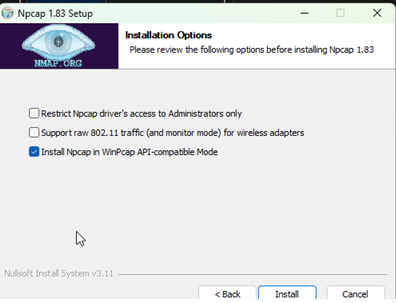

# Spirit Vale Overlay

> [!NOTE]
> **Community continuation.** Spirit Vale Overlay was created by
> [kar-mi](https://github.com/kar-mi/spirit-vale-overlay), who stopped maintaining it in September
> 2026 and invited others to take it over. This fork carries it on: it follows game updates and
> adds fixes and features. It is not affiliated with the original author or with the game.

Spirit Vale Overlay is a passive Windows companion app for live combat, character, reward, and in-game overlay information. It uses your existing Npcap installation in non-promiscuous mode and never sends, modifies, drops, or injects game traffic. Disclaimer for packet capture dps tools, packet capture is based on proxmity, so dps for other players will go down when out of range.

**[Installation guide →](https://yuridisu.github.io/spirit-vale-overlay/install/)** · [Troubleshooting](https://yuridisu.github.io/spirit-vale-overlay/troubleshooting/) · [Report an issue](https://github.com/Yuridisu/spirit-vale-overlay/issues)

The same guides live in this repository: [docs/install/index.md](docs/install/index.md) and
[docs/TROUBLESHOOTING.md](docs/TROUBLESHOOTING.md).

> The capture, decoding, and catalog packages that used to live in
> [spirit-vale-tools](https://github.com/kar-mi/spirit-vale-tools) are now part of this repository,
> under [tools/](tools/).

> **Default overlay hotkeys:** `Ctrl+Shift+1` locks or unlocks the overlay, `Ctrl+Shift+2` resets the
> session, `Ctrl+Shift+3` opens the live death log, `Ctrl+Shift+4` shows or hides the overlay,
> `Ctrl+Shift+5` cycles the party meter, `Ctrl+Shift+6` / `Ctrl+Shift+7` reset all-time XP / gold, and
> `Ctrl+Shift+8` cycles the boss timer tile between regions when you have timers in more than one.
> These can be rebound in Settings. Hotkeys pass through to the foreground program, so its normal
> action for the same combination still runs. Windows may also use Ctrl+Shift to switch input languages
> when configured that way.

## Features

The launcher gives you quick access to combat DPS, rewards, and character
tools. The shared Settings window contains general, network, overlay, and keybind
configuration.


The in-game overlay shows live party DPS along with HP/MP during combat.


The **[Guide](https://yuridisu.github.io/spirit-vale-overlay/guide/)** walks
through each tool with screenshots — the overlay and its tiles, combat logs and
the death log, boss timers, character data, rewards, build export, and every
settings tab.

## Installation

### Pre-install

Before installing Spirit Vale Overlay, download and install Npcap from
[npcap.com/#download](https://npcap.com/#download). Select **Install Npcap in
WinPcap API-compatible Mode** and leave **Restrict Npcap driver's access to
Administrators only** unchecked.



### Portable release

1. Download the latest `spirit-vale-overlay-windows-x64-v*.zip` from [GitHub Releases](https://github.com/Yuridisu/spirit-vale-overlay/releases/latest).
2. Extract the complete ZIP. It contains one versioned folder, such as `spirit-vale-overlay-windows-x64-v0.10.9`.
3. Open that folder and run `spirit-vale-overlay-win_x64.exe`.

The portable app supports Windows x64 and, by default, keeps its settings, logs, and writable runtime data inside the extracted folder.

To store data in Windows AppData instead:

1. Close Spirit Vale Overlay completely.
2. Delete `.spirit-vale-portable` from the extracted application folder.
3. Restart the app. New data will be stored under `%APPDATA%\Spirit Vale Overlay\data`.

Deleting the marker does not move existing portable data. To keep your current settings, open **Settings > Manage Settings** before deleting it and export them, then import them after restarting. You can also import directly from the old extracted folder's `data` directory.

If the app does not start, shows a blank window, or cannot capture game traffic, see the [Windows troubleshooting guide](docs/TROUBLESHOOTING.md).

### Run from source

This path is only for developers building the application. It requires Bun 1.4.0 or newer; every
package is in this repository, so no registry token is needed.

```powershell
bun install
bun run --filter @svoverlay/desktop update
bun run dev
```

To verify or package a source build:

```powershell
bun run check
bun run build
bun run package:portable
bun run verify:portable
```

### Capture diagnostics

For a short reproduction of a packet-capture or map-transition issue, launch the app from PowerShell
with diagnostic logging enabled:

```powershell
$env:SPIRIT_VALE_DIAGNOSTIC_LOGS = "1"
bun run dev
```

The resulting session includes `other.jsonl` alongside `combat.jsonl`. Around each authenticated game
connection it records five seconds of buffered LiteNet traffic and ten seconds after authentication,
plus connection-admission decisions and status-RPC decoder input/output. Raw transition traffic is
bounded to 8 MiB before and 32 MiB after authentication; a `capture.diagnosticLimit` record reports
truncation. Diagnostic logs contain raw game-network payloads and endpoint addresses, so review them
before sharing and disable the environment variable after reproducing the issue.

## Support

Open a [GitHub issue](https://github.com/Yuridisu/spirit-vale-overlay/issues) for a question or a
reproducible bug.

## After a game update

A game update can renumber the network messages the overlay decodes. With the game installed and
closed, refresh the bundled map from its files and run the tests:

```powershell
bun run tools/scripts/refresh-rpc-map.ts "C:\Program Files (x86)\Steam\steamapps\common\SpiritVale"
bun run check
```

The script renumbers messages by name. It does not refresh SyncType indexes, prefab layouts, or
struct layouts, so check a live capture after an update that changes those.

## VPN Issues

Using a VPN or network optimizer such as ExitLag can prevent packet capture.
See [VPN Issues](docs/vpn/VPN_ISSUES.md) for known tools and fixes.

## Releases

See [RELEASE.md](RELEASE.md) for GitHub setup and Windows release instructions.
